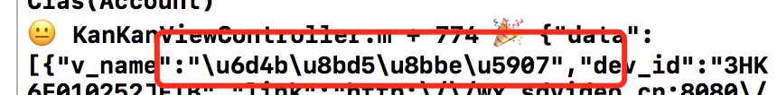
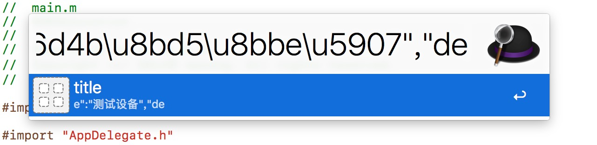

# alfred-unicode-tools
unicode 转化成汉字


使用 `Script Filter`
核心代码如下:

```js
function unicodeDecode(unicStr){
   unicStr = eval("'" + unicStr + "'");
   unicStr = unescape(unicStr.replace(/\u/g, "%u"));
   unicStr = unescape(unicStr.replace(/\U/g, "%u"));
   return unicStr;
}

function run() {
  	var query = "{query}";
	var res = unicodeDecode(query);
	var items = [];
     items.push({
         title:res,
         arg:res
     });
  return JSON.stringify({items:items});
}
```

##使用

(iOS)别问我为什么不加分类,不想加 😂



呼出 alfred 然后 keyword:`deunic` 




